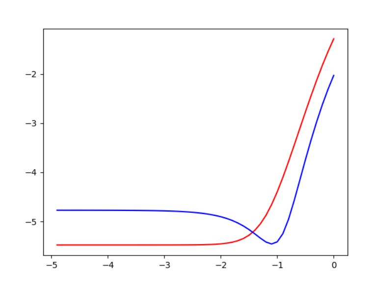
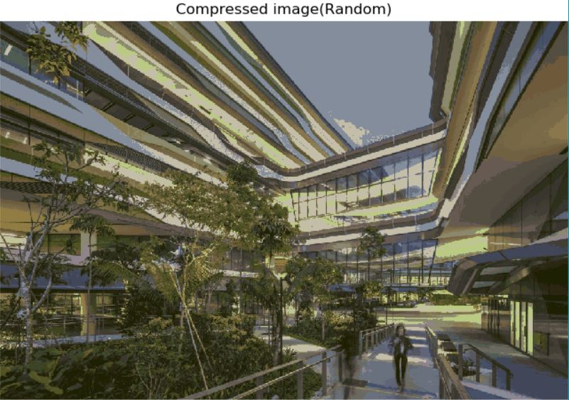
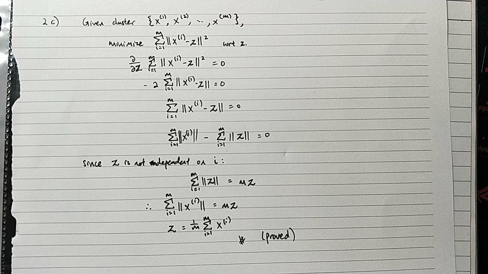

# Machine Learning Homework 2

Name: Clemence Goh (1002075)
---
Question 1
---
1 a)

Code:
```python
import numpy as np


csv = "D:\desktopStorage\school\SUTD_Machine_Learning_01.112\Homework\Week2\www.dropbox.com\s\oqoyy9p849ewzt2\linear.csv"
data = np.genfromtxt(csv, delimiter=',')

# all data into X and Y
X = data[:, 1:]
Y = data[:, 0]

def printShapes1a():
    # create validation set matrices
    vX = X[0:10, :]  # feature
    vY = Y[0:10]  # response

    # create training set matrices
    tX = X[10:, :]
    tY = Y[10:]

    print("Shapes:")
    print('vX:', vX.shape)
    print('tX:', tX.shape)
    print('vY:', vY.shape)
    print('tY:', tY.shape)
```

Output:
```
Shapes:
vX: (10, 4)
tX: (40, 4)
vY: (10,)
tY: (40,)
```

---
1 b)

Code:
```python
def ridgeRegression1b():
    # regularization penalty
    reg_penalty = 0.15

    # using values from homework 1...
    d = X.shape[1]
    n = X.shape[0]
    learn_rate = 0.5

    # create feature matrix
    vX = T.matrix(name='vX')

    # create response vector
    vY = T.vector(name='vY')

    # placeholder for w
    w = theano.shared(np.zeros((d, 1)), name='w')

    main_regression = (T.dot(vX, w).T - vY)**2 / 2 / n
    regulizer = reg_penalty * (w[0, 0]**2 + w[1, 0]**2 + w[2, 0]**2)

    reg_loss = T.sum(main_regression + regulizer)
    gradient_loss = T.grad(reg_loss, wrt=w)

    train_model = theano.function(inputs=[],
                                  outputs=reg_loss,
                                  updates=[(w, w - learn_rate * gradient_loss)],
                                  givens={vX: X, vY: Y})

    # similar to homework 1...
    n_steps = 50
    for i in range(n_steps):
        train_model()

    print(w.get_value())
```

Output:
```
[[ 1.48396101e+41]
 [-2.08705210e+41]
 [-5.84424363e+40]
 [-2.26627489e+39]]
 
 
Assume last term w[3, 0] is irrelevant
```

---
1 c)

Code:
```python
from scipy.optimize import fmin_l_bfgs_b as minimize

def costgrad(w, x, y):
    reg_penalty = 0.15
    
    n = x.shape[0]
    cost = np.sum((np.dot(x, w).T - y)**2)/2/n + \
           reg_penalty * (w[0]**2 + w[1]**2 + w[2]**2) / 2

    a = np.asarray([w[0], w[1], w[2], 0])
    grad = reg_penalty * a + np.dot(np.dot(x.T, x), w)/n - \
           np.dot(x.T, y)/n

    return cost, grad


def bfgsOptimizer1c():
    global X, Y

    # data from global as above
    X = data[:, 1:]
    Y = data[:, 0]

    d = X.shape[1]
    w = np.zeros((d, 1))

    optx, cost, messages = minimize(costgrad, w, args=[X, Y])
    print(optx)

```

Output:
```
Resulting value for w:

w = [-0.51575135  1.18644932  0.03302971 -1.86038231]
```

---
1 d)

Code:
```python
def ridge_regression(tX, tY, l):
    training_data_shape = tX.shape[0]

    # I matrix with diagonal 1 and 0 elsewhere
    i_matrix = np.eye(4)
    i_matrix[3, 3] = 0

    result = np.dot(np.dot(
        np.linalg.inv(
            training_data_shape * l * i_matrix + np.dot(tX.T, tX)),
            tX.T),
        tY)

    return result


def ridgeRegression1d():
    global X, Y
    X = data[:, 1:]
    Y = data[:, 0]
    w = ridge_regression(X, Y, 0.15)
    print(w)
```

Output: Same as 1 c)
```
[-0.51575135  1.18644932  0.03302971 -1.86038231]
```

---
1 e)

Code:
```python
def plotValidationGraph1e():
    global X, Y

    tX = X[10:, :]
    tY = Y[10:]
    vX = X[0:10, :]
    vY = Y[0:10]

    tn = tX.shape[0]
    vn = vX.shape[0]
    tloss = []
    vloss = []
    index = -np.arange(0, 5, 0.1)
    for i in index:
        w = ridge_regression(tX, tY, 10 ** i)
        tloss = tloss + [np.sum((np.dot(tX, w) - tY) ** 2) / tn / 2]
        vloss = vloss + [np.sum((np.dot(vX, w) - vY) ** 2) / vn / 2]

    #print(w)

    plt.plot(index, np.log(tloss), 'r')
    plt.plot(index, np.log(vloss), 'b')
    plt.show()
```

Result:
```
Value of lambda that minimizes validation loss: 0.1
```

Graph Shown:


---
Question 2
---

2 a)

Code:
```python
import numpy as np
import numpy.random as rng
import matplotlib.image as mpimg
from sklearn.cluster import KMeans

n_colors = 32
pic = 'sutd.png'
img = mpimg.imread(pic)
img = img[:, :, :3]

w, h, d = tuple(img.shape)
image_array = np.reshape(img, (w * h, d))

def fitModel2a():
    #print("Current image:", image_array.shape)

    image_sample = image_array[rng.randint(w * h, size=1000)]
    kmeans = KMeans(n_clusters=n_colors, random_state=0)
    kmeans = kmeans.fit(image_sample)

    kmeans_labels = kmeans.predict(image_array)

    print("pixel labels:\n{}".format(kmeans_labels))

```

Output:
```
pixel labels:
[ 5 21 21 ... 12 12 12]
```

---
2 b)

Full Code:
```python
import numpy as np
import numpy.random as rng
import matplotlib.pyplot as plt
import matplotlib.image as mpimg
from sklearn.cluster import KMeans
from sklearn.metrics import pairwise_distances_argmin

n_colors = 32
pic = 'sutd.png'
img = mpimg.imread(pic)
img = img[:, :, :3]

w, h, d = tuple(img.shape)
image_array = np.reshape(img, (w * h, d))


def recreate_image(palette, labels, w, h):
    d = palette.shape[1]
    image = np.zeros((w, h, d))
    label_idx = 0

    for i in range(w):
        for j in range(h):
            image[i][j] = palette[labels[label_idx]]
            label_idx += 1
    return image


# Derive kmeans palette and kmeans labels using k-means clustering.
def givenFigurePlots(kmeans_palette, kmeans_labels, random_palette, random_labels):
    plt.figure(1)
    plt.clf()
    ax = plt.axes([0, 0, 1, 1])
    plt.axis('off')
    plt.title('Original image(16.8 million colors)')
    plt.imshow(img)

    plt.figure(2)
    plt.clf()
    ax = plt.axes([0, 0, 1, 1])
    plt.axis('off')
    plt.title('Compressed image(K - Means)')
    plt.imshow(recreate_image(kmeans_palette, kmeans_labels, w, h))

    plt.figure(3)
    plt.clf()
    ax = plt.axes([0, 0, 1, 1])
    plt.axis('off')
    plt.title('Compressed image(Random)')
    plt.imshow(recreate_image(random_palette, random_labels, w, h))
    plt.show()


def fitModel2a():
    # print("Current image:", image_array.shape)

    image_sample = image_array[rng.randint(w * h, size=1000)]
    kmeans = KMeans(n_clusters=n_colors, random_state=0)
    kmeans = kmeans.fit(image_sample)

    kmeans_palette = kmeans.cluster_centers_
    kmeans_labels = kmeans.predict(image_array)

    # print("pixel labels:\n{}".format(kmeans_labels))

    return kmeans_palette, kmeans_labels


def formRandomPalette2b():
    random_palette = image_array[rng.randint(w * h, size=n_colors)]
    random_labels = pairwise_distances_argmin(X=random_palette,
                                              Y=image_array,
                                              axis=0)
    # print(random_labels)
    return random_palette, random_labels


if __name__ == '__main__':
    kmeans_palette, kmeans_labels = fitModel2a()
    random_palette, random_labels = formRandomPalette2b()
    givenFigurePlots(kmeans_palette, kmeans_labels, random_palette, random_labels)

```

Output:
```
formRandomPalette2b: [29 29  2 ... 20 20 20]
```

Original Image:


Compressed Image (K-Means):


Compressed Image (Random Compression):


---
2 c)

Working:



---
Question 3
---

3 a)

Code:
```python
import numpy as np
import pandas as pd
from IPython.display import display


X_data = pd.read_csv("train.csv")
X_test = pd.read_csv("test.csv")
X_valid = X_data.sample(frac=0.2, random_state=200)
X_train = X_data.drop(X_valid.index)
Y_data = X_data["Survived"]
Y_valid = X_valid["Survived"]
Y_train = X_train["Survived"]
ID_test = X_test["PassengerId"]


def displayData():
    display(X_data.head())
    display(X_data.describe())
    display(X_test.head())
    display(X_test.describe())


def preproces(df):
    df = df.copy()
    df.drop(["PassengerId", "Survived"], axis=1, inplace=True, errors="ignore")
    df.drop(["Name", "Ticket", "Cabin"], axis=1, inplace=True)
    df["Embarked"].fillna(df["Embarked"].mode()[0], inplace=True)

    # todo: fill in the blanks
    df["Fare"].fillna(df["Fare"].median(), inplace=True)
    df["Age"].fillna(df["Age"].mean(), inplace=True)

    #print(df)

    df = df.join(pd.get_dummies(df["Embarked"]))
    df.drop(["Embarked"], axis=1, inplace=True)
    df = df.join(pd.get_dummies(df["Sex"]))
    df.drop(["Sex"], axis=1, inplace=True)
    df = df.join(pd.get_dummies(df["Pclass"]))
    df.drop(["Pclass"], axis=1, inplace=True)

    df.loc[:, "Family"] = (df["Parch"] + df["SibSp"] > 0) * 1
    df.loc[:, "Child"] = (df["Age"] < 16) * 1

    return df


def automatedPreprocess3a():
    global X_train, X_valid, X_data, X_test

    X_data = preproces(X_data)
    X_test = preproces(X_test)
    X_valid = preproces(X_valid)
    X_train = preproces(X_train)

    #display(X_data.head())
    #display(X_test.head())
    #display(X_valid.head())
    display(X_train.head())


if __name__ == '__main__':
    automatedPreprocess3a()

```

Output:
```
         Age  SibSp  Parch     Fare  C  Q  ...    male  1  2  3  Family  Child
0  22.000000      1      0   7.2500  0  0  ...       1  0  0  1       1      0
2  26.000000      0      0   7.9250  0  0  ...       0  0  0  1       0      0
3  35.000000      1      0  53.1000  0  0  ...       0  1  0  0       1      0
4  35.000000      0      0   8.0500  0  0  ...       1  0  0  1       0      0
5  29.449243      0      0   8.4583  0  1  ...       1  0  0  1       0      0

[5 rows x 14 columns]
```

---
3 b)

Code:
```python
from sklearn.linear_model import LogisticRegression 

def logisticRegression3b():
    global X_valid, Y_valid, X_train, Y_train
    
    # from sklearn.linear_model
    logistic_reg = LogisticRegression()
    logistic_reg.fit(X_train, Y_train)
    
    print(logistic_reg.score(X_valid, Y_valid))
```

Output:
```
Score:
0.792134831461 
```

---
3 c)

Code:
```python
def findParameter3c():
    logistic_reg = LogisticRegression()
    logistic_reg.fit(X_train, Y_train)

    Y_test = logistic_reg.predict(X_test)

    coeff_df = pd.DataFrame(X_data.columns.delete(0))
    coeff_df.columns = ['Features']
    coeff_df['Coefficient Estimate'] = pd.Series(logistic_reg.coef_[0])

    display(coeff_df)
```

Output:
```
Value of parameter vector:


```

---

3 d)

Code:
```python
def predictLabel3d():
    Y_test = findParameter3c()

    ans = pd.DataFrame({"PassengerId": ID_test, "Survived": Y_test})
    ans = pd.DataFrame({"PassengerId": ID_test, "Survived": Y_test})
    ans.to_csv("submit.csv", index=False)

```

Kaggle:

```
Kaggle ID: Clemence Goh
Score: 0.73205

```


