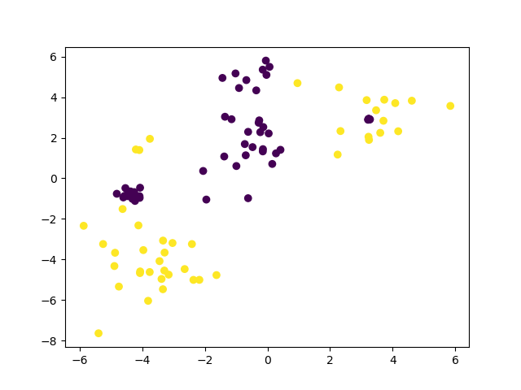
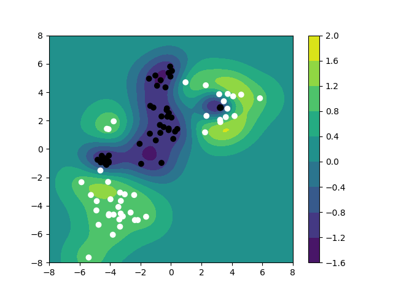
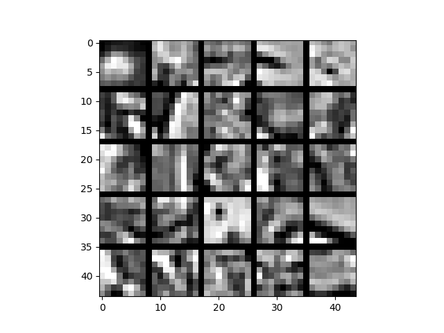
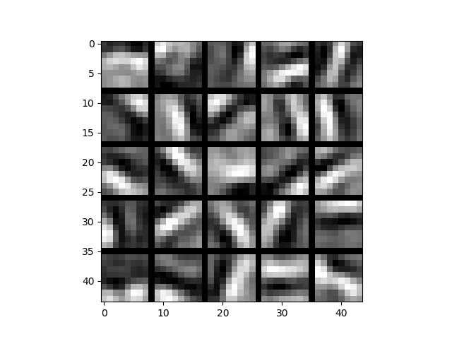
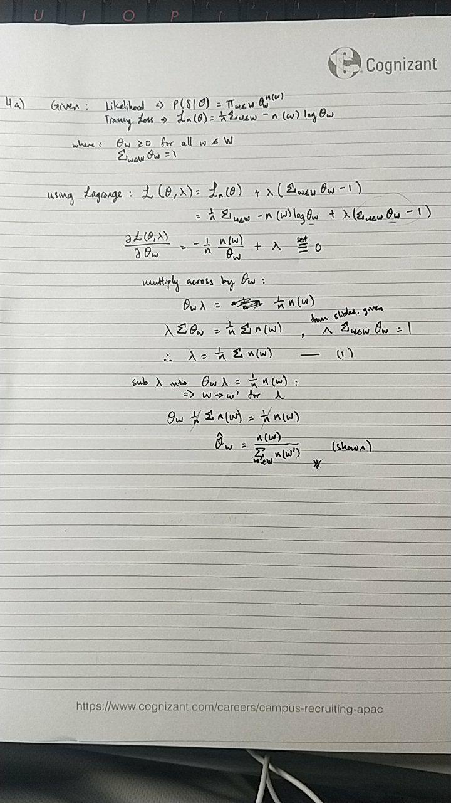
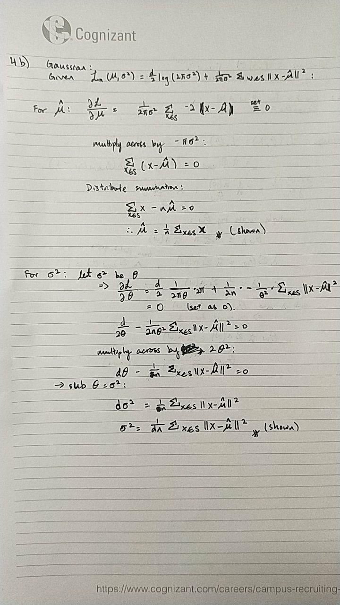

# Homework 3

Name: Clemence Goh (1002075)

Talked to: Cheryl Goh

---
Question 1
---
1 a) 

Objective is to find a rank-one matrix which is closest to the 
incomplete matrix M, where:
```
M = [[0, 1, x],
     [1, x, 1],
     [x, 1, 2]]
``` 

Code:
```python
import numpy as np


# using alternating least squares method for collaborative filtering:
# http://www.quuxlabs.com/blog/2010/09/matrix-factorization-a-simple-tutorial-and-implementation-in-python/
def get_error(Q, X, Y, W):
    return np.sum((W * (Q - np.dot(X, Y)))**2)


def matrix_factorization(R, P, Q, K, steps=10000, alpha=0.0002, beta=0.02):
    Q = Q.T
    for step in range(steps):
        for i in range(len(R)):
            for j in range(len(R[i])):
                if R[i][j] > 0:
                    eij = R[i][j] - np.dot(P[i, :], Q[:, j])
                    for k in range(K):
                        P[i][k] = P[i][k] + alpha * (2 * eij * Q[k][j] - beta * P[i][k])
                        Q[k][j] = Q[k][j] + alpha * (2 * eij * P[i][k] - beta * Q[k][j])
        eR = np.dot(P, Q)
        e = 0
        for i in range(len(R)):
            for j in range(len(R[i])):
                if R[i][j] > 0:
                    e = e + pow(R[i][j] - np.dot(P[i, :], Q[:, j]), 2)
                    for k in range(K):
                        e = e + (beta/2) * (pow(P[i][k], 2) + pow(Q[k][j], 2))
        if e < 0.0001:
            break
    return P, Q.T


def initialiseVariables():
    R = np.array(
        [[0, 1, np.nan],
         [1, np.nan, 1],
         [np.nan, 1, 2]]
    )
    N = len(R)
    M = len(R[0])
    K = 1  # number of rows

    P = np.random.rand(N, K)
    Q = np.random.rand(M, K)
    return M, N, K, P, Q, R


def checkAgainst(_nR):
    desired_matrix = np.array(
        [[0, 1, np.nan],
         [1, np.nan, 1],
         [np.nan, 1, 2]]
    )
    for i in range(len(desired_matrix)):
        for j in range(len(desired_matrix[0])):
            # skip these numbers
            if i == 0 and j == 2 or i == 1 and j == 1 or i == 2 and j == 0:
                continue
            else:
                if round(_nR[i][j]) != desired_matrix[i][j]:
                    return False
    return True


if __name__ == '__main__':
    M, N, K, P, Q, R = initialiseVariables()

    nP, nQ = matrix_factorization(R, P, Q, K)
    nR = np.dot(nP, nQ.T)
    print(nR)
    print(nP)
    print(nQ)
    print(checkAgainst(nR))
```

Results:
```
A:
[[1.02515492 0.82214388 1.35229942]
 [0.85242192 0.68361713 1.12444436]
 [1.43113499 1.14772787 1.88783469]]
 
U:
[[0.97078532]
 [0.8072133 ]
 [1.35523404]]

V:
[[1.05600579]
 [0.84688536]
 [1.39299533]]
```


---
Question 2
---

2 a)

Data plotted: 


Code:
```python
import numpy as np
import matplotlib.pyplot as plt
from sklearn import svm


def showGraph(_plt):
    _plt.show()


def plotGraphData():
    csv = 'kernel.csv'
    data = np.genfromtxt(csv, delimiter=',')

    X = data[:, 1:]
    Y = data[:, 0]
    plt.scatter(X[:, 0], X[:, 1], c=Y)
    return X, Y, plt


def part1():
    _, _, plt = plotGraphData()
    showGraph(plt)
    
    
train.csv
# set gamma to 0.5, kernel to rbf
def trainSVM():
    # part a
    clf = svm.SVC(gamma=0.5, kernel='rbf')
    X, Y, plt = plotGraphData()
    clf.fit(X, Y)
    return clf, X, Y
```

Result:
```
clf:
SVC(C=1.0, cache_size=200, class_weight=None, coef0=0.0,
  decision_function_shape='ovr', degree=3, gamma=0.5, kernel='rbf',
  max_iter=-1, probability=False, random_state=None, shrinking=True,
  tol=0.001, verbose=False)
```
---
2 b)

Code:
```python
# this is for part b
def decision(_x1, _x2, _clf):
    x = np.array([[_x1, _x2]])
    return _clf.decision_function(x)[0]
```

---
2 c)

Code:
```python
# part c
def visualiseClassifier():
    clf, X, Y = trainSVM()
    vdecision = np.vectorize(decision, excluded=[2])
    x1list = np.linspace(-8.0, 8.0, 100)
    x2list = np.linspace(-8.0, 8.0, 100)
    X1, X2 = np.meshgrid(x1list, x2list)
    Z = vdecision(X1, X2, clf)
    cp = plt.contourf(X1, X2, Z)
    plt.colorbar(cp)
    plt.scatter(X[:, 0], X[:, 1], c=Y, cmap='gray')
    plt.show()
```

Graph Plotted:


---
Question 3
---
3.

Data matrix X:


---
3 a)

code: 
```python
import numpy as np
from numpy.linalg import norm
import matplotlib.pyplot as plt
from scipy.optimize import fmin_l_bfgs_b as minimize
from Homework.Week6.utils import normalize, tile_raster_images, sigmoid, ravelParameters, unravelParameters
from Homework.Week6.utils import initializeParameters, computeNumericalGradient


def initialiseVariables():
    nV = 8 * 8  # number of visible units
    nH = 25  # number of hidden units
    dW = 0.0001  # weight decay term
    sW = 3  # sparsity penalty term
    npy = 'images.npy'
    X = normalize(np.load(npy))
    return nV, nH, dW, sW, X
    
    
# part a
def sparseAutoencoderCost(theta,nV,nH,dW,sW,X):
    W1,W2,b1,b2 = unravelParameters(theta,nH,nV)
    n = X.shape[0]
    z2 = np.dot(X, W1) + np.dot(np.ones((n, 1)), b1.T)
    a2 = sigmoid(z2)
    z3 = np.dot(a2, W2) + np.dot(np.ones((n, 1)), b2.T)
    a3 = sigmoid(z3)
    eps = a3-X
    loss = 0.5 * np.sum(eps**2)/n
    decay = 0.5 * (np.sum(W1 ** 2) + np.sum(W2 ** 2))

    # Compute sparsity terms and total cost
    rho = 0.01
    a2mean = np.mean(a2,axis=0).reshape(nH,1)
    kl = np.sum(rho*np.log(rho/a2mean)+ (1-rho)*np.log((1-rho)/(1-a2mean)))
    dkl = -rho/a2mean+(1-rho)/(1-a2mean)
    cost = loss+dW*decay+sW*kl
    d3 = eps * a3 * (1 - a3)
    d2 = (sW*dkl.T+np.dot(d3,W2.T))*a2*(1-a2)
    W1grad = np.dot(X.T, d2)/n + dW * W1
    W2grad = np.dot(a2.T, d3)/n + dW * W2
    b1grad = np.dot(d2.T, np.ones((n, 1)))/n
    b2grad = np.dot(d3.T, np.ones((n, 1)))/n
    grad = ravelParameters(W1grad,W2grad,b1grad,b2grad)
    print(' .',end="")
    return cost,grad


def checkCostGradFunction():
    nV, nH, dW, sW, X = initialiseVariables()
    theta = initializeParameters(nH, nV)
    cost, grad = sparseAutoencoderCost(theta, nV, nH, dW, sW, X)
    return cost, grad
```

Running checkCostGradFunction() gives:
```
 .
Cost: 54.352568640271166
 
Grad: [ 0.76502459  0.94329594  0.79515806 ...  0.02468031  0.00289279
 -0.02947588]
```

---
3 b)

code:
```python
def compareGradients():
    # from previous
    nV, nH, dW, sW, X = initialiseVariables()
    theta = initializeParameters(nH, nV)
    cost, grad = sparseAutoencoderCost(theta, nV, nH, dW, sW, X)

    print('\nComparing numerical gradient with backprop gradient')
    num_coords = 5
    indices = np.random.choice(theta.size, num_coords, replace=False)
    numgrad = computeNumericalGradient(lambda t: sparseAutoencoderCost(t, nV, nH, dW, sW, X)[0], theta, indices)
    subnumgrad = numgrad[indices]
    subgrad = grad[indices]
    diff = norm(subnumgrad - subgrad) / norm(subnumgrad + subgrad)
    print('\n', np.array([subnumgrad, subgrad]).T)
    print('The relative difference is', diff)
```

Running comapreGradients() gives Result:
```
Comparing numerical gradient with backprop gradient
 . . . . . . . . . .
 [[-0.03965281 -0.03965281]
 [ 0.72180184  0.72180184]
 [ 0.85801614  0.85801614]
 [-0.00907039 -0.00907039]
 [ 0.89547885  0.89547885]]
The relative difference is 4.9672839287460054e-11
```

---
3 c)

Code:
```python
def trainNeuralNetwork():
    nV, nH, dW, sW, X = initialiseVariables()
    theta = initializeParameters(nH, nV)
    opttheta, cost, messages = minimize(sparseAutoencoderCost, theta, fprime=None, maxiter=400,
                                        args=(nV, nH, dW, sW, X))
    W1, W2, b1, b2 = unravelParameters(opttheta, nH, nV)
    plt.imshow(tile_raster_images(X=W1.T, img_shape=(8, 8), tile_shape=(5, 5), tile_spacing=(1, 1)), cmap='gray')
    plt.show()
```

Output Graph:


---
Question 4
---

4 a)


---
4 b)
