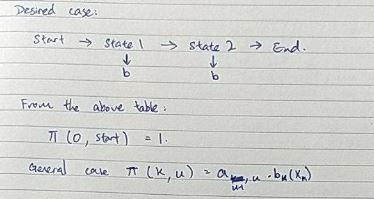
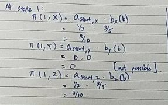
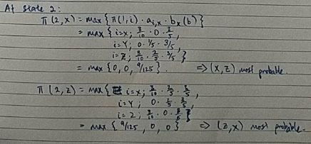
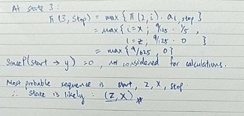
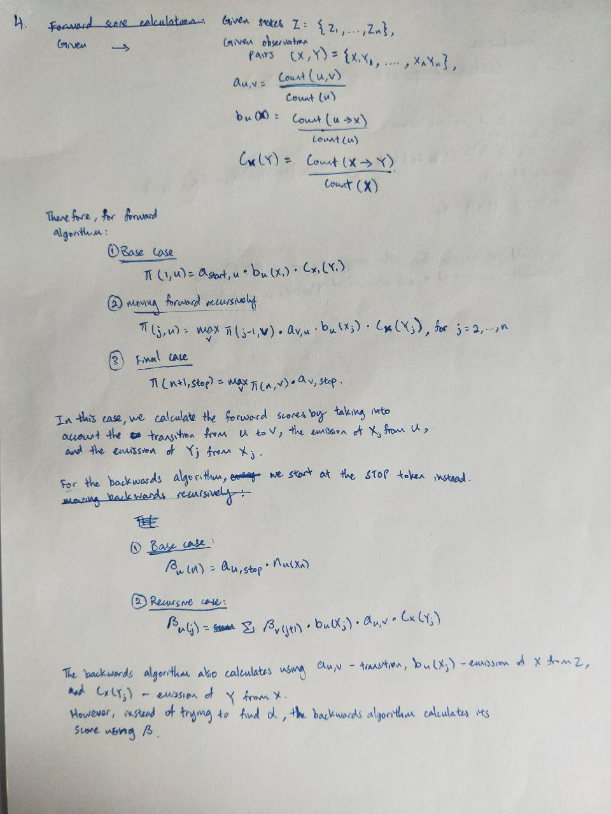
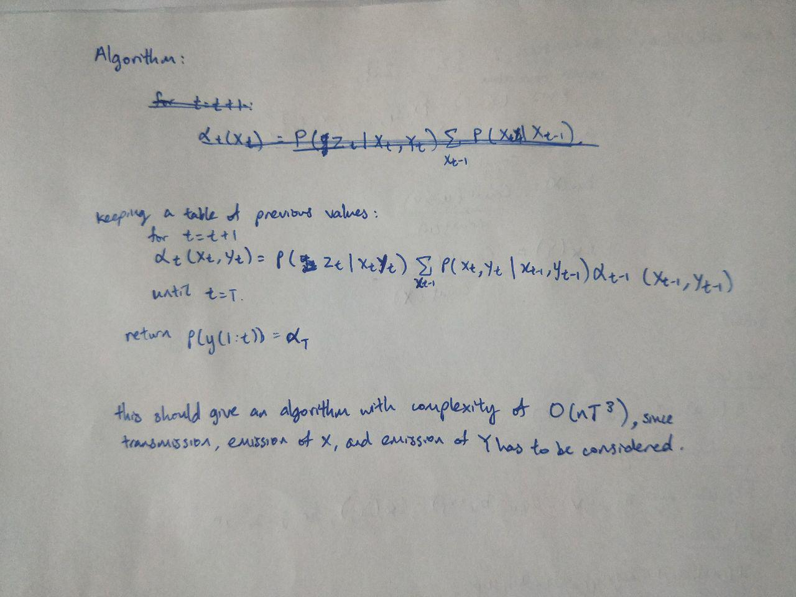

# Homework 4

Name: Clemence Goh
---

Question 1:

Parameters associated with the HMM:
- **Transmission Probability**
    - For every row, add a start state as y0, and
    and end state as yn+1.
- Workings:
    - Start:
        - Total transitions: 4
            - 2/4 => X
            - 2/4 => Z
    - X:
        - Total transitions: 5
            - 2/5 => Y
            - 1/5 => Stop
            - 2/5 => Z
    - Y:
        - Total transitions: 5
            - 3/5 => Stop
            - 1/5 => Z
            - 1/5 => X
    - Z:
        - Total transitions: 5
            - 3/5 => Y
            - 2/5 => X
            

- Final result:
    
| - | X | Y | Z | Stop |
| --- | --- | --- | --- | --- |
| Start | 1/2 | 0 | 1/2 | 0 |  
| X | 0 | 2/5 | 2/5 | 1/5 |
| Y | 1/5 | 0 | 1/5 | 3/5 |
| Z | 2/5 | 3/5 | 0 | 0 |

- **Emission Probability**
    - For every state in the sequence, count the 
    corresponding word observed

- Workings:
    - X: 
        - Total count: 5
            - 3/5 => b
            - 2/5 => a
    - Y: 
        - Total count: 5
            - 3/5 => c
            - 2/5 => a
    - Z:
        - Total count: 5
            - 1/5 => a
            - 3/5 => b
            - 1/5 => c

- Final Result:

| - | a | b | c |
| --- | --- | --- | ---|
| x | 2/5 | 3/5 | 0 |
| y | 2/5 | 0 | 3/5 |
| z | 1/5 | 3/5 | 1/5 |

---
Question 2:

---
Question 3:

In the Viterbi algorithm, finding the argmax of 
probability of the previous states will necessarily 
give the most optimal answer. Therefore, this can be thought of as
top-1 decoding. 

To support top-k decoding, for every step j, instead of
finding max of previous, we should keep the top k states containing
the highest probabilities and store them to be used in the next step.

At the end of the viterbi algorithm, the backpointers should point
to k number of optimal paths at most from all previous states,
allowing us to obtain the top k probable state transitions.

---
Question 4:

