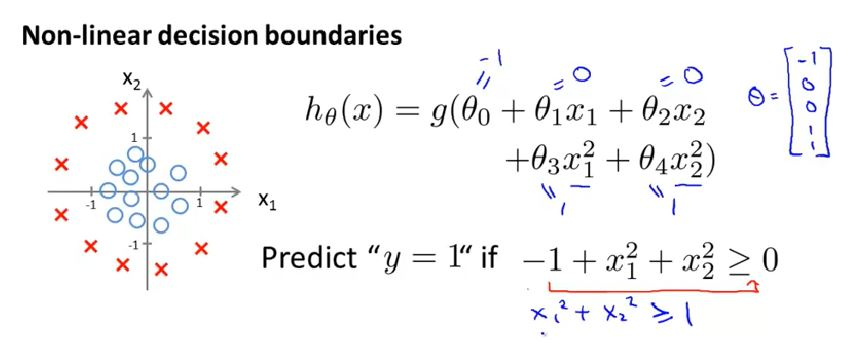

# Compilation of Formulas for exam

---
Different Types
---

| - | Supervised Learning | Unsupervised Learning |
| --- | --- | --- |
| Data | Data + label | Data only |
| Examples | Classification,  Regression,  Structured Prediction | Clustering,  Dimension Reduction |
| Classification | Perceptron, SVM, Logistic Regression, Neural Networks, Decision Tree, Naive Bayes | - |
| Regression | Linear Regression, Ridge Regression, Multivariate Regression | - |
| Structured Prediction |  | - |
| Clustering | - | k-means, Expectation-Maximization | 
| Dimension Reduction | - | Recommendation,  Matrix Factorization,  Principle Component Analysis,  Autoencoder, Generative Adversary Network (GAN) |

---

| - | Regression | Classification |
| --- | --- | --- |
| Output | Real-valued Outputs | Discrete values |
| Used for | Extrapolation, predicting a response | Identifying group membership |

---
Perceptron
---
The Perceptron is an algorithm for **Supervised Learning**
of binary classifiers.

Contains:
- Weight
- Sum
- Activation (0 or 1 from float)

Multiclass Perceptrons:
- Used for multiclass classification
- Comprises of feature representation function:
    - 
    - 

---
Linear Regression
---
- Is a part of Supervised Learning
    - Given the "right answer" for each example in data
- Used in Regression Problem
    - Predict real valued outputs
- Idea is to find the best fit line for the training data

Useful Notation terms:
- Denoting data from set:
    - 

Hypothesis:
- This denotes a function generated after the Learning
Algorithm has been trained by the training set.
- h(x)
- Possible Hypothesis:
    - 
    - *theta* represents parameters of the model
- Want the difference between output of hypothesis and actual 
data to be small.
    - i.e. 
    - This can be equated to J(*theta0*, *theta1*), which is 
    the cost function (Squared Error cost function)
    
    
---
Hypothesis VS Cost function
---

--- 
Gradient Descent
---

Basic function:

How to Minimize?
- Always take partial derivative and equate to 0

Optimal value of theta:
- Set X as Mx2 matrix, [1, x].
- Set Y as a Nx1 matrix. [y]
- Optimal value:
    - 

When should you use Gradient Descent and when should you
use normal?
- Comparisson:

- n ~ 10 000 is a large number

---
Normal equation
---
- What happens if X*T*X is non-invertible?
    - There are redundant features (linearly dependent)
    - There are too many features (m <= n)
        - Delete features, or use regularization
    
    
---
Classification (Single and Multi-Class)
---
- Examples: (Binary)
    - Email => Spam/not spam
    - Fradulent transaction
    - Tumor: Malignant/Benign?

- For multi-class:
    - 

- Cannot use Linear Regression, since more data points could
possibly result in a worse hypothesis

- Logistic Regression is used instead. (hypothesis representation)

---
Regularization
---
- Ridge Regression:
    - Must be familiar with bias and variance
    - Explanation:
        - 
        - Introduce new, test data:
        - 
        - Compare to other parts of data:
        - 
        - 
        
    - From training data, find linear line which fits best
        - Following this, find line with test data
        - Often, test data lines could result in an overfit,
        as well as a high variance from the other data.
    
    - Lambda: (Bias)
        - 

    - The number of data required for least squares
    **must** be at least the same number of parameters (dimensions)
    - Therefore, with less data samples, Ridge Regression can be used.
    - Ridge Regression can find a solution using cross validation
    and the Ridge Regression Penalty, which favours smaller parameter
    values. It wins where least squares can not.
    
    
    
    
---
Logistic Regression 
---
**NOTE**:
- **Sigmoid function == Logistic function**
    - Sigmoid functions have a characteristic "S" shaped curve
    - Sigmoid function is a special case of the Logistic function where
    `L = 1, k = 1, x0 = 0`.
    - L is the max value the function can take,
    - x0 controls where on the x axis the growth should be.
    - k controls how steep the change from minimum to maximum value is.
    

- Want 0 <= h(x) <= 1 (classifier output 0 or 1)
- Modify from previous (Linear Regression):
    - from:
    - 
    - To:
    - 

- This Sigmoid function will have asymptotes at 0 and 1
    - 

- Hypothesis output denotes the probability that y=1 for input x
- Following probabilty: **P(y=0|x;*theta*) + P(y=1|x;*theta*) = 1**
    - This means that the probability of y being 0 + y being 1 given 
    point x must add up to 1 (Probability rule)

However: It is not always the case where g(z)>0 return 1; g(z)<0 return 0

Hence, a **Decision Boundary** must be used.

How do we determine this?
- Simple decision boundary:
- 

**Non-linear decision boundaries**
- This requires a plane
- 
- By adding polynomial factors within the equation, we can get
more complicated decision boundaries, which are linear on a higher
dimension.

Logistic Regression: Cost Function
- Using the cost function, we want to minimize it:
    - 
- Deriving it:
    - Minimise the cost function by taking the derivative
    - 
    - End result with alpha:
    - 
- What has changed? Very similar to Linear regression
    - Definition of the hypothesis has changed, not the same.
    - This causes equation to look the same, but actually is no longer linear

---
Batch Gradient Descent & Stochastic Gradient Descent
---

Algorithms shown below:

Batch Gradient descent: Naive method.
- 
- This algorithm goes through all n items for every iteration to take 
a single step towards the optimum

Stochastic Gradient descent: More efficient for scaling
- 

Mini-batch gradient descent: (variation of batch)

| Batch | stochastic | Mini-batch |
| --- | --- | --- |
| Use all m examples in each iteration | Use 1 example in each iteration | Use b examples in each iteration |

Algorithm:
- 

---
Correlation coefficient
---
- Similarity *sim(a,b)* == *corr(a,b)*
- 
- 

---
SVM & Kernels
---
Idea is to leave a line as wide as possible between the boundaries
- Makes use of decision boundaries
- The Equation of the line should be **w*T*x + b = 0**
- To find the distance between the 2 lines defining the 
boundary:
    - Sub values in each of the equations for both lines
    - Create 2 equations
    - subtract one from the other to get an equation to represent both
        - This is because both are essentially unit vectors,
        subtracting on from the other gives a **vector** from
        one to the other 
        - Working through this:
        - 
        - 
        -         
        - Lagrange ends up like this:
        - 
        - This is due to the equation subtracted by its constraints
        - Solve using Lagrange
        - 
        - 
        - After optimizing, the output is + or - based on this rule:
        -  
        - Guaranteed global maxima, will not get stuck on a local maxima
    
Kernel methods use **kernel functions**, which enables them to 
operate in a high-dimensional, implicit feature space without ever 
computing the coordinates of the data in that space, but rather
by simply computing the inner products (dot product) between the images
of all pairs of data in the feature space. (cheap operation)
This is called the **"kernel trick"**.

==> This is used when there are non-linear decision boundaries

Kernel function is the similarity
- 
- Example of a gaussian kernel:
- 
- This ends up predicting binary based on distance to certain points,
due to different weights on different points. (circle will be drawn around 
each of these points)

Slack Variables:
- Data outliers which make it non-linearly separable
- Determine Slack Varaibles (outliers) and ignore them to give best line
- 

---
Bayes Theorem Classifier
---
Log likelihood ratio test.
- Always dealing with joint probability

---
Convolutional Neural Networks (CNN)
---
- built upon vanilla neural networks
- works by edge detection
- Very commonly used for image recognition
- Convolution operation (*) compresses by putting the image
through a filter
- 
- The resulting matrix will always be (n-f+1) by (n-f+1)

- **Padding**
    - Pad so that output size is the same as the input size.
    - No padding: 6x6 * 3x3 = 4x4
    - With padding (border full of 0s): 8x8 * 3x3 = 6x6
        - P = padding = 1 (pixel, usually)
- **Stride**
    - Size of steps taken when filtering
    - Formula now becomes:
        - floor[(n + 2p - f)/S + 1] by floor[(n + 2p - f)/S + 1]
        
- Terms:
    - n x n image
    - f x f filter
    - padding *p*
    - stride *s*

- Last notes:
    - convolving on volumes (RGB)
    - 

---
Recurrent Neural Networks (RNN)
---

- Involves forward and back propogation

- Forward prop:
    - Terms: (things needed for this algorithm)
        - a: output of previous
        - g(x): activation function
        - y: yield/generator output for user
        - w: weight 
        - b: bias
        - x: manual input, could be y from previous
    - 
    
    - finding Wa: stack Waa with Wax
        - Visualisation:
        - 
        - This is to simplify the equation for future algorithms

- Back-propagation:
    - Find loss, back prop using partial derivatives and chain rule
    - Using pure formulation:
        - 
    - Nat's notes: (On chain rule)
        - 
        - 
        - 

---
---
---
---
Common Questions
---
- Ultimate goal of every machine learning algorithm:
    - Generalization
    
- Top 2 dangers of treating machine learning as a black box:
    - Algorithm may be applied to data which does
    not fulfill the asusmptions of the algorithm => wrong conclusion
    - Difficult to discerns if machine learning outcomes are 
    due to statistically-significant relationships in the data,
    or if they are just consequences of the algorithmic design

- Top 2 roles of **unsupervised** learning in **supervised** learning
    - To find better features for supervised learning
    - To reduce dimensionality of supervised learning problem
    
- Over/Underfit
    - Bias denotes the distance/difference of
    training from validation
    - Variance denotes the rate of change of the 
    difference between training and validation

| Type | Bias | Variance |
| --- | --- | --- | 
| Underfit | high | low |
| Just right | low | low |
| Overfit | low | high |

---
Hinge loss:
- 
- Note that y should be the "raw" output of the classifier's 
decision function, not the predicted class label. 
For instance, in linear SVMs, y= w . x +b
where *(w, b)* are the parameters of the hyperplane and 
x is the point to classify.

---
Sample 1 - Types of Regressions and Classifications

Predictors:
- 

Learning Objective/Cost Function:
- 

Learning Algorithms:
- 

| Technique | Predictor | Learning Cost | Learning Algorithm |
| --- | --- | --- | --- |
| Ridge Regression | P1 | C2 | A1, A3 | 
| Linear classification, hinge loss | P2 | C3 | A3 |
| Linear Regression | P1 | C1 | A1, A3 |
| Perceptron (with Offset) | P2 | C5 | A2 |
| SVM with Slack Variables | P2 | C4 | A3 |

---

