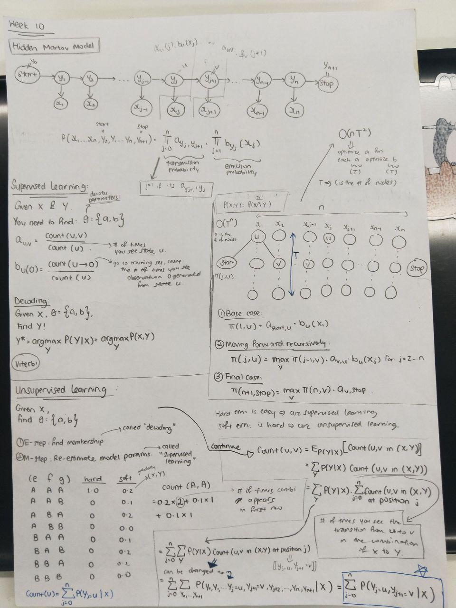
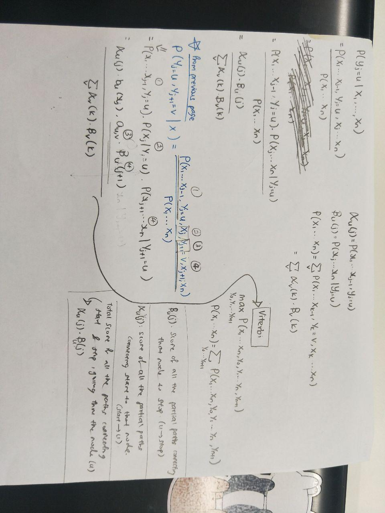

# Back to HMM

Labels available:
*START* => y => *STOP*

Interested in joint probability of all x and y:
- P(x1,x2,x3,....,y0,y1,....yN+1) = Product(n, j=0, *a*yI,yI+1) *dot* Product(n, j=1, *b*yj(xj))
- Why does the Product equation look like this? 
    - Since we're counting y from 0 => n+1, and *a* is the transition, we're interested in 
    transition of current y and next y (yI+1). Therefore, we start from 0 and end at n, since
    n+1 will be considered this way too.
    - Since we're only interested in emission for *b* value, we take x starting from x1,
    and end at xN.
    

In Supervised Learning:
---
Given: X, Y => Find *theta* = {a, b}
- Same as homework
- After parsing and building the model:
    - Use on test
    - Y* denotes the y that maximises the conditional probability of P(y|x)
        - Therefore, Y* must = argmax P(Y|X) = argmax P(X,Y)
        - to find argmax P(X,Y), take the highest occurance/frequency of X from Y 
            - Take the most commonly occuring word belonging to the label.
    
Viterbi Algorithm
---
Using Dynamic Programming to find the most likely:
- Introduce variable *pi*(j,u), which is the score of the partial path between 
node j and node u
    - Steps:
        1. Base case:
            - *pi*(1,u) = *a*start,u *dot* *b*u(x1)
        2. Moving forward recursively:
            - *pi*(j,u) = Max,v(*pi*(j-1,v) *dot* *a*v,u *dot* *b*u(Xj)) for j=2,....,n
        3. Final case:
            - *pi*(n+1,STOP) = Max,v(*pi*(n,v) *dot* *a*v,STOP)
    - For each position you have t nodes
        - Therefore, total number of dimensions is n x T.
        - With dynamic programming, every iteration is 1 x T.
            - Complexity: O(nT^2)
        - With brute force, every iteration required looping through previous
            - Complexity: O(T^n)
            
E-M method
---
- Note that the number of states is a hyperparameter (has to be defined in algorithm)
- Hard E-M method:
1. In the E step: Find membership
    - "Decoding" step, where you find Y* (argmax...)
2. In the M-step: Re-estimate model parameters
    - Call "Supervised learning"

- For the soft E-M method, the probability decides the probability of getting
a set of y values given a combination of x. P(Y|X), eg. given e, f, g, find
probabilities of state: AAA, AAB, ABB, BBB.....
- Soft E-M method:
- Count(A,A) ==> Count the number of times that state A transitions to A
    - This is a probability, eg. 0.2x2 + 0.1x1 + 0.1x1
- Breaking this down:
    - count(u,v) = Sum(P(Y|X) x Count(u,v in (x,y)))
    - = Sum,y(P(Y|X) x Sum(j=0, n, Count(u, v in (X,Y) at position j)))
    - **MATH MAGIC**
    - = Sum(n, j=0, P(yj=u,yj+1=v|X)))
    

ALPHA AND BETA
---
- *alpha*u(j) = P(x1,x2,...,Xj-1, yj=u)
- *beta*u(j) = P(xj,....,xn|yj=u)

    
End Notation:
- *a*uv: generate transition v from current u
- *b*u(Xj): generate emission Xj from current u

End equation looks at probability of current state and next state given **ALL X**
- = P(yj=u,yj+1=v|X)

**VITERBI CALULATES USING MAX**
- All calculations above uses Sum instead of sum
- Ergo, viterbi can still be used, calculate the sum for **soft EM**

- 
- 

