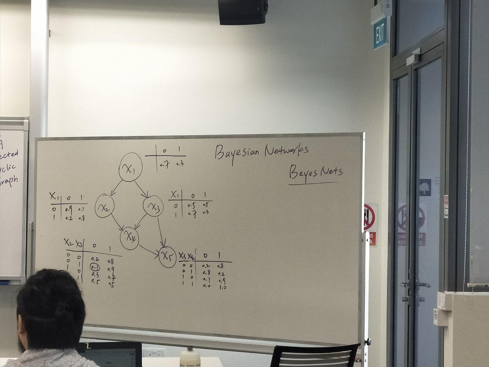
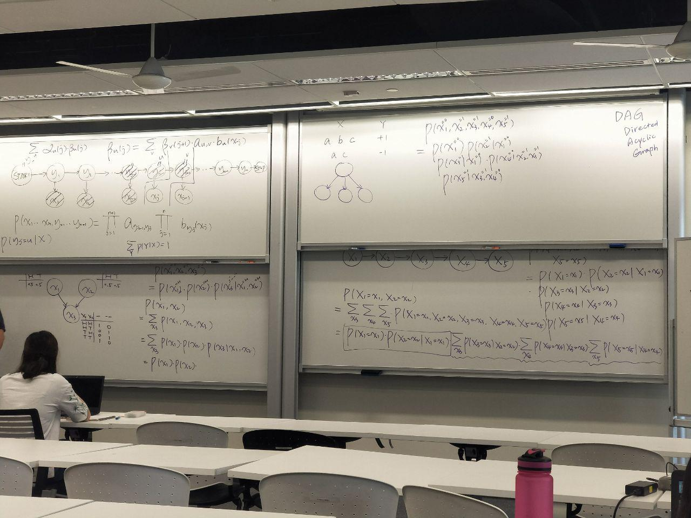
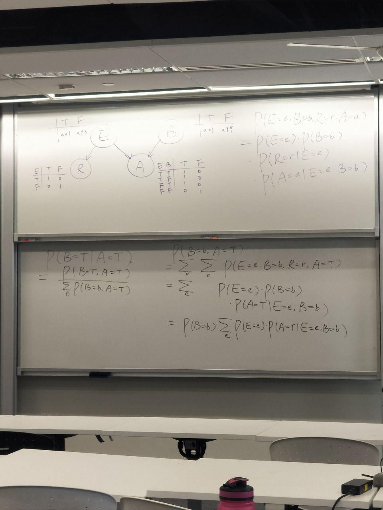
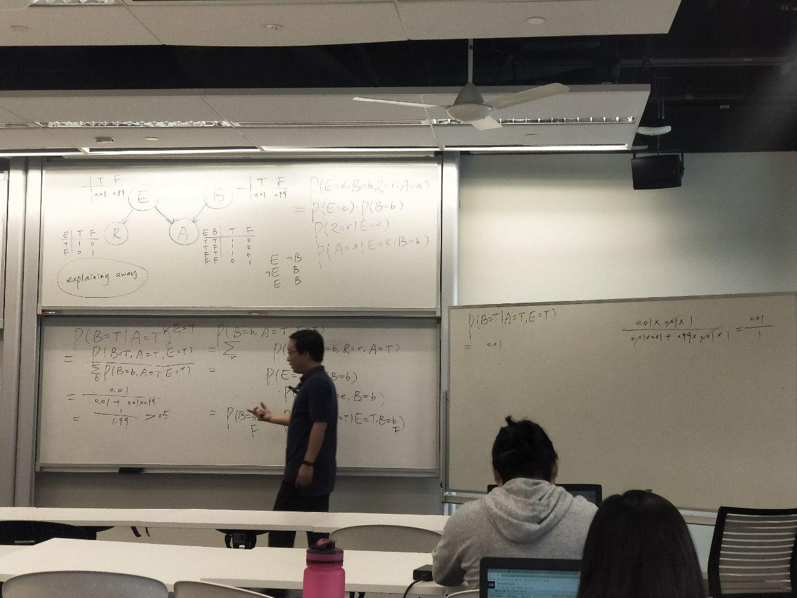

# HMM and conditional

Graphs must be DAG (Directed Acyclic Graphs)
- Presence of cycles results in interdependence, unable to generate the first one.

In HMMs, there are 2 types of model parameters - a's and b's.
- On each Edge, model parameter table able to be attached
    - For example, in x1 node, attach table of 0,1 = 0.7,0.3.
    - Shows probability of travelling along each vertice.
    - The number of rows are the parents (previous values)
    - The number of columns are always 2, (binary - assuming state either gives 0 or 1)
    - 
    - These Binary networks are called Baynesian Networks
        - **IMPORTANT**: HMMs are a special case of baynesian networks

Conditional Independence and Independence:
- 

New Problem:
- 
Finding P(B=T|A=T):
- Rewrite as ratio
    - = **P(B=T,A=T)/ Sum(P(B=b,A=T))**
- Find formula to calculate B=b, A=T.
- Next step is to find the equations which allow you to read directly off the table
- Small letter denote all possibilities within the Capital letters

- In general, always find an equation with only sum, P(A=T), P(A=F), P(B=b),...
    - Also possible to find an equation with P(A=T|E=e,B=b), since this can be
    read off the table.
- Workings:
- 
    

