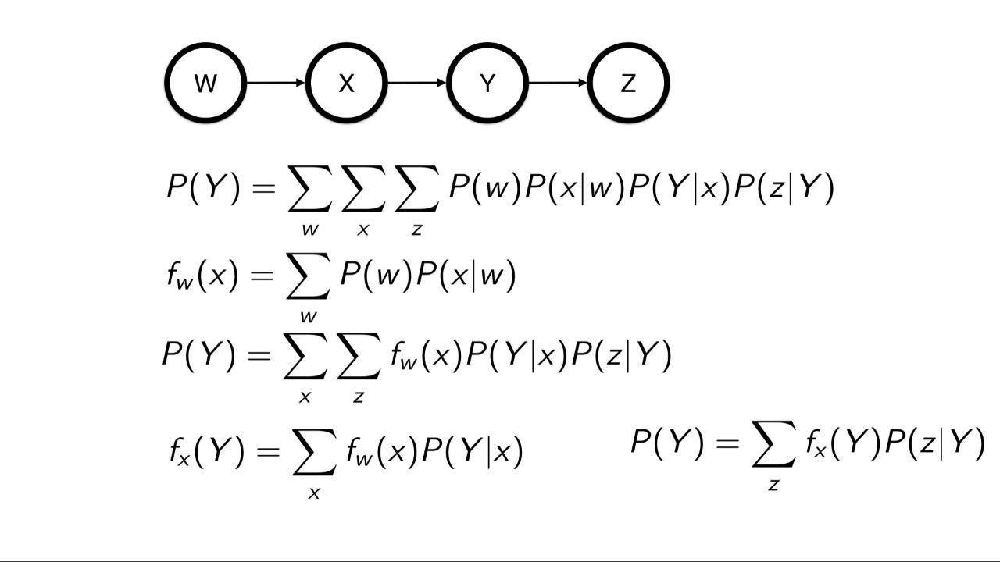
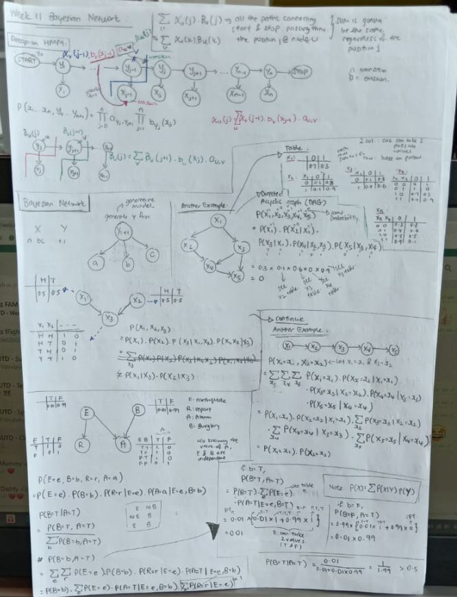
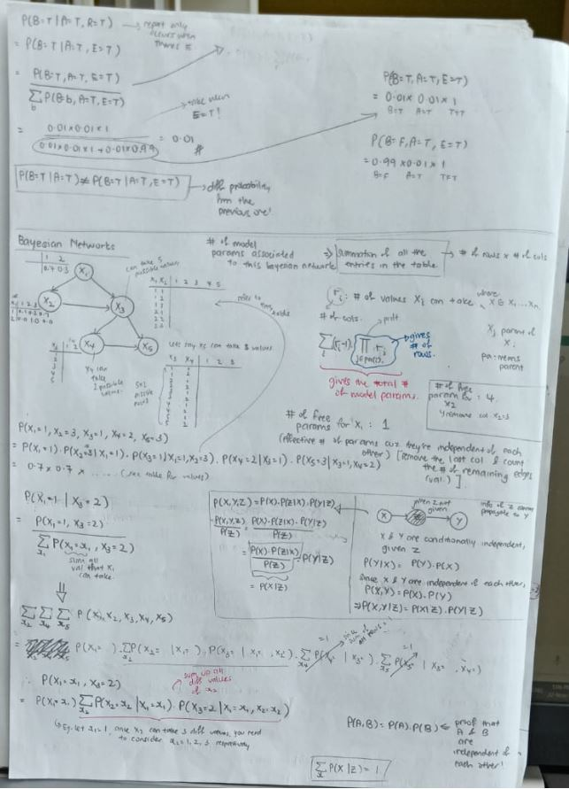
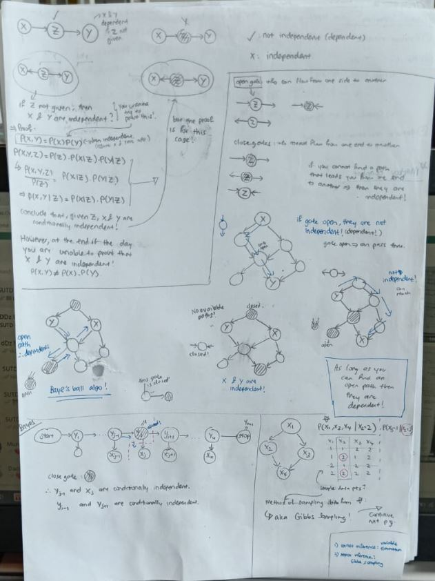

# Bayesian Networks

Review Prev lesson
---
A bayesian network is a way of representing structure
of events. It is a probabilistic graphical model
that represents a set of variables and their conditional dependencies 
via a Directed Acyclic Graph (DAG).

- 
- In the example above, can see that the 
probabilities of each event are connected (not independent)
- To combine all of them, we look at a simple
*joint probability* of:
    - P(G,S,R) = P(G|S,R) P(S|R) P(R)
    - The arrows denote which events are dependent 
    on which
    - General case: P(X|parents)

Reducing Variables
---
- By taking a function of variable, we can extract
it out.
- If we're interested in G, as with example above,
sum everything else.
- Iterate:
    - Choose variable to eliminate
    - Generate new factor
    - Replace it in
    - Finally, generate function of G (interested)
    - will end up with P(G) = Sum,child(function(G),P(...|G))
- More concrete example from video:
- 

- Still P-Hard algorithm

Properties of Bayes
---
-
    - The above shows that C is independent of B,
    once A, D and E are observed (summed up)
    
- 
- 
- 

