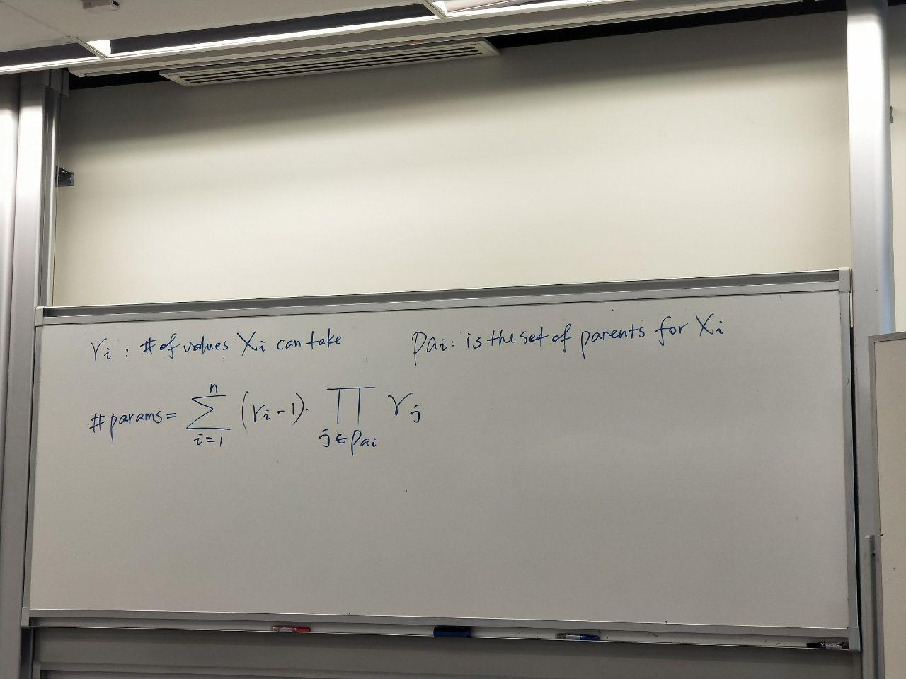
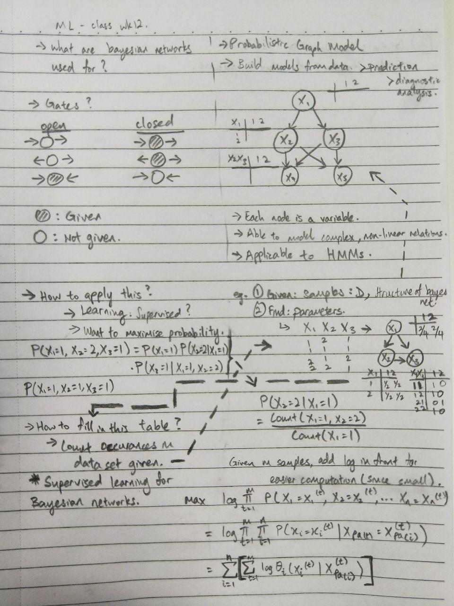
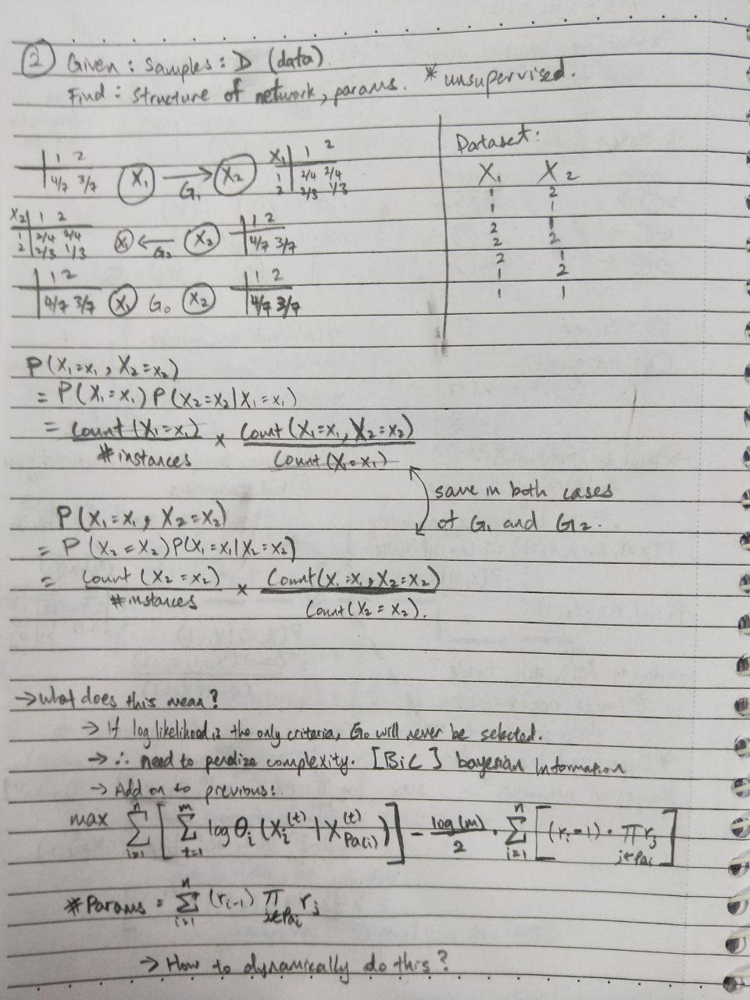

# More on Bayesian Networks

- Problem: Define parents in mathematical notation

- In class:
- Basic formula:
    - 
- Supervised Learning:
    - 
- Unsupervised Learning:
    - 
- Next lesson: reinforcement Learning
