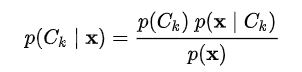
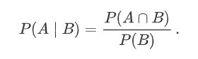
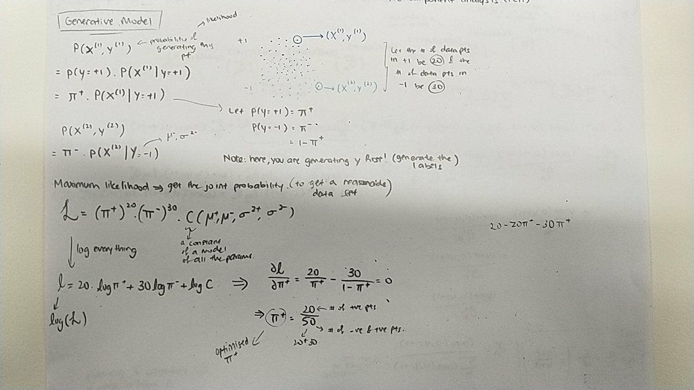
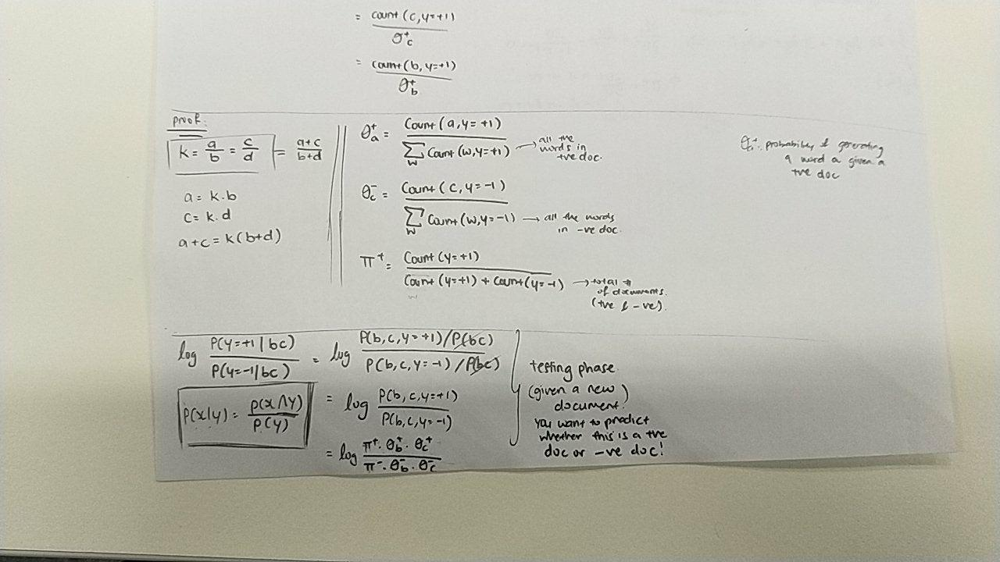
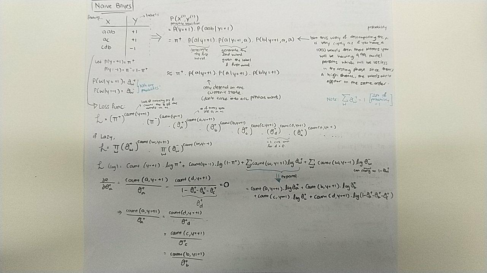

# Generative models

---
Hidden Markov Model
---

| Terms | Meaning | 
| --- | --- |
| Stochastic | Adjective which describes something randomly determined. (Random) |
| Stochastic Process | Mathematical object denoting a collection of random variables. This could be in any number of dimensions. |
| Markov Property | Memoryless property of a stochastic process |
| Markov Model | Stochastic Model used to model randomly changing systems, with Markov's property: depends only on the current state |
| Markov Chain | Models state of system through time, distrubution depends on distribution of prev state |
| Hidden Markov Model | Markov model in which state is only partially observable: used in speech recognition |
| Markov Decision Process | In a Markov Chain, depends on current state put through an action vector |

---
Bayes Classifier
---

Step 1:
- To find probability of generating point (x,y):
    - P(x,y) = P(y).P(x|y) ==> Prob = Prob of choosing y, and prob of choosing x given y

Step 2:
- Find probability of all of them happening at the same time
- Find the likelihood of all points generated at the same time (multiply all) 

Step 3:
- Find partial derivative and maximise for each pi+ and pi-
- Note that pi+ and pi- are related in such a way that pi+ == (1 - pi-)

---
- When faced with a conditional probability, use Bayes theorem to change
it to joint probabilty instead:
    - 
    - Convert to joint:
    - 
    
Learning about a new class under supervised learning, called 
**structured prediction**:
- Mainly applied to natural language processing

Example given:

| Noun | Verb | Determinent | Adjective | Noun |
| --- | --- | --- | --- | --- |
| Faith | is | a | fine | invention |

Note that this has to be conditionally independent

Suggested:

- Naive model:
    - Generate y (the labels)
    - Generate a from y
    - Generate next a from y
    - Generate b from y

- Generate y:
    - Start => N => V => D => A => N => Stop
    -

- Workings:
    - 
    - 
    - 